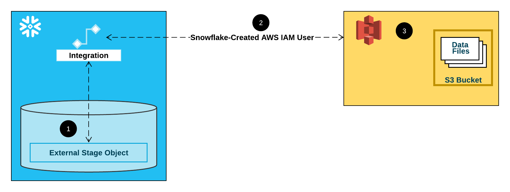

# **Snowflake Data Ingestion Demonstration**

## **Goal**<br>

Create an **auto ingestion** pipeline using:

- Terraform to set AWS and Snowflake Infrastructure 
- Flask Form WebApp as Data Source deployed using PythonAnywhere
- S3 Bucket as Staging Area
- Snowflake Snowpipes for Automatic Ingestion (Bucket Notifications)
- Snowflake as Data Warehouse
    - Schemachange Python Tool to create Tables and Pipes.

<br>

---

##  **The Data Pipeline**


---
## *Explaining how Auto Ingestion with Snowpipe Works*

Snowpipe relies on External Stage Storage (e.g: S3) and Queue Services (e.g: SQS) to perform auto ingestion.
To do that it is necessary to set a *trust relationship* between Cloud Provider and Snowflake Accounts.
Since this Demo is using AWS, the explanation is focused on it. <br>
The following steps should be followed to setup Snowpipe Auto Ingestion:


### 1. **Create IAM Policy with Access Rules to S3 Bucket** 


### 2. **Create Cross Account Trust Relationship IAM Role**


### 3. **Create Snowflake Storage Integration**<br>
Here you should indicate the created role ARN from step 2.


### 4. **Get Storage Integration Snowflake User ARN + External ID**


### 5. **Role Trusted entities:**<br>
#### 5.1. Set variable for External ID (Condition)<br>
#### 5.2. Set Users that should have the role access (Principal)


### 6. **Create Snowpipe and Table to be ingested**


### 7. **Use below command and get *notificationChannelName***
```sql
SELECT SYSTEM$PIPE_STATUS('<PIPE_NAME>');
```


### 8. **Go to S3 Bucket and Create a Bucket Notification Event using Snowpipe SQS ARN**

### 9. **Ready to Go! Start to Ingest your Files**

---
### ***Storage Integration Representation:***
<br>
[]

---

## **References:**

- [Pythonanywhere Website](https://www.pythonanywhere.com/)

- [Snowflake Terraform Provider Documentation](https://registry.terraform.io/providers/chanzuckerberg/snowflake/latest/docs)

- [Schemachange Repo](https://github.com/Snowflake-Labs/schemachange)

- [Automating Snowpipe for Amazon S3](https://docs.snowflake.com/en/user-guide/data-load-snowpipe-auto-s3.html#step-1-configure-access-permissions-for-the-s3-bucket)

- [Getting User Location in  Flask](https://stackabuse.com/how-to-get-users-ip-address-using-flask/)

- [Ip Stack API](https://ipstack.com/)